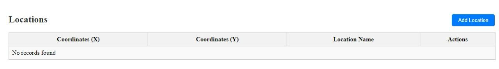

# Full-Stack Weather Application
## I、Project Description

PHP Backend and Angular Frontend
This project is a full-stack web application designed to provide users with real-time weather data. The application integrates a PHP backend API with an Angular frontend, utilizing the National Weather Service (NWS) API for weather information.

Backend: PHP API

RESTful API Development:
The backend is developed using PHP, providing a set of RESTful API endpoints to manage weather data retrieval and user interactions.

NWS API Integration:
The PHP backend interfaces with the National Weather Service API to fetch current weather data and forecasts. This involves making HTTP requests to the NWS API and processing the responses to format the data appropriately for the frontend.

Database Management:
It connects to a MySQL database to store user preferences, search history, and other relevant data.

Security and Error Handling:
Implements security measures such as input validation and prepared statements to prevent SQL injection. Custom error handling ensures that only critical errors are logged and displayed.


Frontend: Angular Application

Dynamic User Interface:
The frontend is built with Angular, offering a responsive and dynamic user experience. It features a modern design that adapts seamlessly to different devices and screen sizes.

Component-Based Architecture:
Utilizes Angular’s component-based architecture to create reusable and maintainable UI components.

HTTP Client for API Communication:
Uses Angular's HttpClient module to interact with the PHP backend, sending and receiving data efficiently.

State Management:
Manages application state with Angular services and, if needed, state management libraries like NgRx.

Routing and Navigation:
Implements Angular’s router to provide a single-page application experience, allowing users to navigate between different views such as current weather, forecasts, and search history.


Integration with NWS API
Fetching Weather Data:
The PHP backend uses the NWS API to retrieve weather data. This involves sending HTTP GET requests to endpoints provided by NWS to get information such as current conditions, weather alerts, and forecasts.

Data Processing:
The received data is processed and formatted in the PHP backend before being sent to the Angular frontend. This ensures that the frontend receives clean, structured data ready for display.

Real-Time Updates:
The application provides real-time weather updates, fetching new data at regular intervals or upon user request.

## II、Project Environment and Packages

### Environment Setup

| tools                                        | version              |
| -------------------------------------------- | -------------------- |
| [Node.js](https://nodejs.org/zh-tw/download) | ^16.14.0 or ^18.10.0 |
| [git](https://git-scm.com/downloads)         | LTS                  |
| [Angular cli](https://angular.io/cli)        | ^16.1.0              |

## III、Project Startup

BACKEND:

Run using XAMPP Server


FRONTEND:

Enter the following command to install the packages:

```bash
npm install
```

After the packages are installed, enter the following command to start the project:

```bash
ng serve
```
## IV、Commands

- `ng serve` - Start the development server.
- `ng build` - Generate the build package.
- `ng test` - Run unit tests.
- `npm run lint` - Execute code checks.

## V、 Demo

1. Home Page:
    All the locations are displayed in the table as below


2. Add Location Page:
    New location are added using this form


3. Weather Details Page:
    Weather details are shown as this for the respective location

